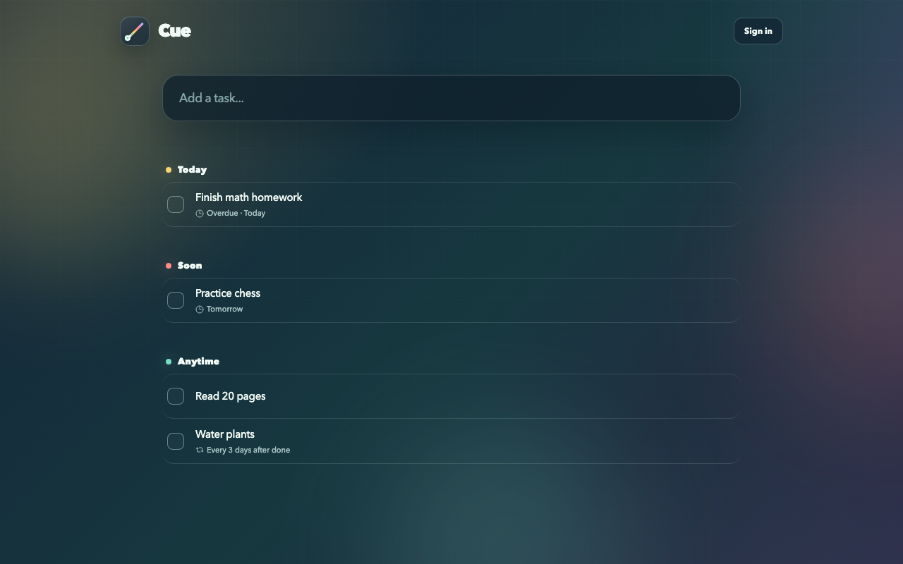

<h1>
  
  Cue
</h1>

> [!NOTE]
> A small, local-first task list for getting thoughts out of your head quickly.

Cue turns short natural-language entries into structured tasks and events. It understands dates, times, durations, recurrence, and deadlines.



## Features

### Natural-language capture

Type things the way you already think about them, like `Call Alex tomorrow at 4pm` or `Water plants every 3 days after completion`. Cue turns the text into a task or event with the right metadata.

### Local-first by default

Tasks live in IndexedDB in your browser. The app can function completely locally and for free.

### Optional AI refinement

Signed-in users can get a second parsing pass through the server.

### Built for quick capture

Cue groups work into Today, Soon, Anytime, and Later, with recurring tasks, snoozing, undo, task editing, and keyboard navigation built in.

## Local development

Install dependencies and start Vite:

```bash
npm install
npm run dev
```

That is enough for the local-only version. To enable sign-in and server AI refinement, copy the example environment file and fill in the services you want to use:

```bash
cp .env.example .env.local
```

`CUE_ADMIN_USER_IDS` is optional. Specified Clerk user IDs bypass the AI rate limits.

## Stack

React, TypeScript, Vite, Dexie, Clerk, Upstash, Motion, and the OpenAI Responses API.